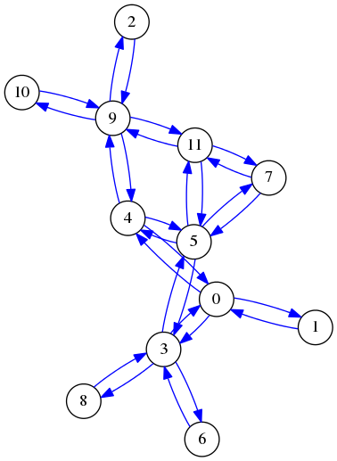

# Graphs, BFS & DFS
A graph class that I made for the final project in my Data structures class.

## Design
It essentially uses an adjacency list to model the connections between nodes.

example of the printing function of the graph class.

## Asymtotics
`//fill in`
